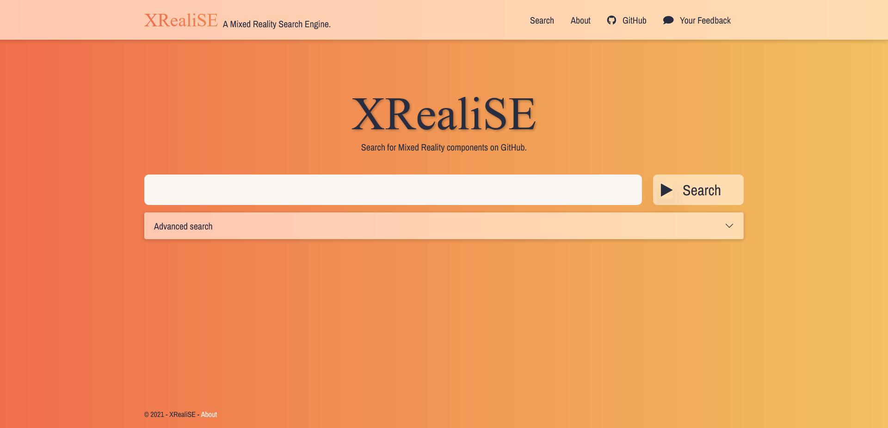
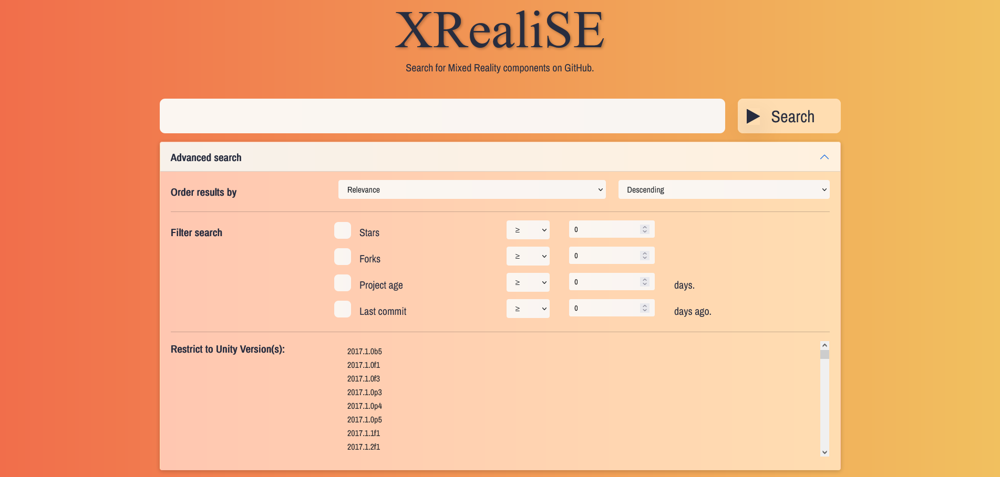
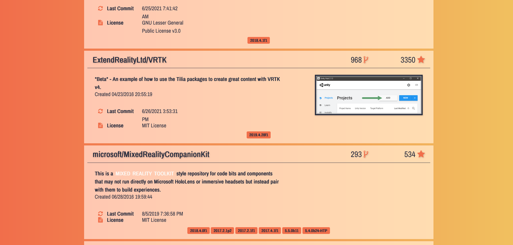

# XRealiSE - A Search Engine for Mixed Reality Components

This projects contains a crawler and a search engine to help developers find suitable mixed reality components.
This way, you can re-use existing implementations instead of re-implementing them yourself.
The search engine is specialized on finding open-source Unity projects with mixed reality contexts on GitHub.

You can try out the live version [here](https://xrealise.dbis.rwth-aachen.de/).

[](https://xrealise.dbis.rwth-aachen.de/)

## Features

XRealiSe consists of a crawler which collects information about open-source projects which make use of Unity.
It looks for mixed reality-related packages in these projects to restrict the search space to relevant candidates.
The results are stored in a MySQL database.

The web page with the search mask accesses this database to show relevant results.
Users can enter search terms to look for specific features.
In the advanced search tab, additional restrictions regarding the popularity of the repository, its age or the used Unity version can be made.



The search results show relevant information like the title, a description of the project, the detected Unity versions, the creation date, the date of the last commit and the license.
Moreover, XRealiSE shows the first image that is included in the repository"s readme file.



## Project Setup

This repository consists of a Visual Studio 2019 solution with three projects.
There are separate projects for the crawler and the search website.
Moreover, there is a project which code for the database connection which is shared by the crawler and the search website.

### Crawler

The crawler is a .NET 5.0 console application.
It uses the [Octokit]( https://github.com/octokit/octokit.net) library which is imported via NuGet.

### Database Connection

As an underlying database, MySQL is used.
The project connects to the database via the EntityFramework.

### Website

The website is a ASP.NET Core web application written in .NET 5.0. 

## Example Runtime Configuration on a Linux Server

### Website Compilation and Deployment

1. Install MySQL on the server or on another server to which the web project can have access.
   Install Dotnet on the Web server.
2. After that, enter the connection information in the appsettings.json file of the XRealise-Frontend.
   Under "ConnectionStrings", enter the user and password of the database user, the name of the created database and the URL and port where the MySQL server can be found.
3. If you want to use SSL, generate a PKCS12 certificate from your public certificate and the private key using the command "openssl pkcs12 -export -out full.pfx -inkey my.key -in mycert".
   After that, set up the URLs and certificate paths in the appsettings.json file under "Kestrel".
   ```
   "Kestrel": {
       "Endpoints": {
         "Http": {
           "Url": http://0.0.0.0:80
         },
         "Https": {
           "Url": "https://0.0.0.0:443",
           "Certificate": {
             "Path": "/path/to/my/certificate/full.pfx",
             "Password": "myCertificatePassword"
           }
         }
       }
   ```
4. In the top bar of Visual Studio, make sure that the project flags are set to "Release" and "Any CPU".
   After that, go to "Build > Build Solution" or hit "Ctrl + Shift+ B". 
   Note: You can adjust the settings from steps 1 to 3 after compiling.
   The compilation copies the appsettings.json file to "XRealiSE-Frontend\bin\Release\net5.0\appsettings.json".
   This is the file that is actually used by the running application.
   So, if you want to change settings on the deployed application, change this new appsettings.json file under the Release folder.
5. Copy the content of the entire "XRealiSE-Frontend\bin\Release\net5.0\appsettings.json" folder to your server.
6. You can start the executable with the command "dotnet XRealiSE-Frontend.dll".
   However, if you are remotely accessing the server, this command will be terminated as soon as you disconnect your session.
   Hence, it is advised to create a system service as shown [here]( https://unixcop.com/how-to-create-a-systemd-service-in-linux/).
   After that, start the service with a command like "systemctl --user start --now xrealise.service".
   The service can later be stopped or restarted by replacing the "start" flag with "stop" or "restart".